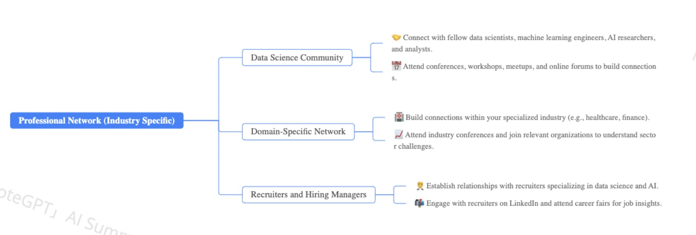
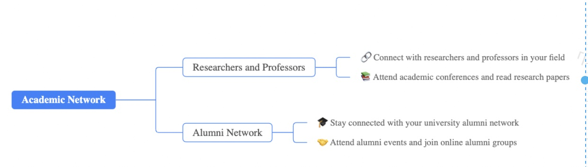
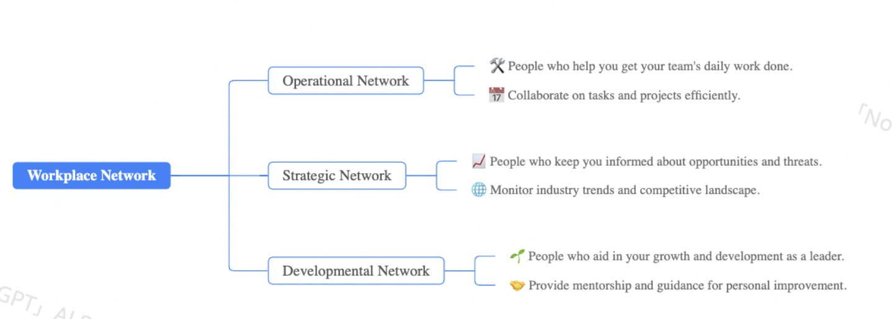

Types of Networks to build
===========================
Building the right networks is crucial for personal and professional success, especially as a data scientist. Here's a breakdown of the types of networks you should consider building, tailored to your goals: 

**1\. Professional Network (Industry Specific):**

*   **Data Science Community:**
    *   This is your core network. Connect with fellow data scientists, machine learning engineers, AI researchers, and analysts. 
    *   **How to build it:** Attend conferences (e.g., NeurIPS, ICML, KDD), workshops, meetups, and online forums (e.g., Kaggle, Reddit's r/datascience, LinkedIn groups). Contribute to open-source projects, and share your knowledge. 
    *   **Benefits:** Stay updated on industry trends, learn about job opportunities, collaborate on projects, and gain mentorship. 
*   **Domain-Specific Network:**
    *   If you specialize in a particular industry (e.g., healthcare, finance, e-commerce), build connections within that sector.
    *   **How to build it:** Attend industry-specific conferences, join relevant professional organizations, and connect with people working in those fields. 
    *   **Benefits:** Understand the unique challenges and opportunities in your domain, and tailor your skills to meet industry needs. 
*   **Recruiters and Hiring Managers:**
    *   Establish relationships with recruiters specializing in data science and AI.
    *   **How to build it:** Attend career fairs, connect on LinkedIn, and actively engage with recruiters' posts.
    *   **Benefits:** Stay informed about job openings, get insider tips on the hiring process, and increase your chances of landing your dream job.

**Academic Network:**

*   **Researchers and Professors:**
    *   Connect with researchers and professors in your field, especially if you're interested in research or academia.
    *   **How to build it:** Attend academic conferences, read research papers, and reach out to researchers whose work you admire.
    *   **Benefits:** Gain access to cutting-edge research, collaborate on projects, and explore academic career paths. 
*   **Alumni Network:**
    *   Stay connected with your university alumni network. 
    *   **How to build it:** Attend alumni events, join online alumni groups, and reach out to alumni working in your field.
    *   **Benefits:** Gain access to mentorship, job opportunities, and industry insights.

**Workplace Network:**
*   **Mentors:**
    *   Seek out mentors who can provide guidance and support in your career and personal development. 
    *   **How to build it:** Reach out to experienced professionals in your field, attend mentorship programs, and build genuine relationships.
    *   **Benefits:** Gain valuable advice, learn from others' experiences, and accelerate your career growth. 
*   **Peers:**
    *   Build strong relationships with your peers, both inside and outside your field.
    *   **How to build it:** Attend social events, join clubs and organizations, and participate in online communities.
    *   **Benefits:** Gain support, build friendships, and expand your social circle.

*   **Cross-Functional Network:**
    *   As a Data scientist, it is very important to build relationships with people in other departments, like marketing, sales, product, and operations. 
    *   **How to build it:** Attend cross departmental meetings, offer your assistance on projects, and make an effort to understand the needs of other departments.
    *   **Benefits:** Increases your understanding of the business, allows you to better apply your data science skills to the business, and it increases your visibility within the company.
 

Workplace network can also be categerized into:

*   **Operational network:** People who help you get your team's daily work done.
*   **Strategic network:** People who help you stay informed about opportunities and threats in the broader environment.
*   **Developmental network:** People who help you grow and develop as a leader.
 

    It is important to be strategic about the current network you have and the network groups that is missing in your connections and actively seeking out connections in that network group
