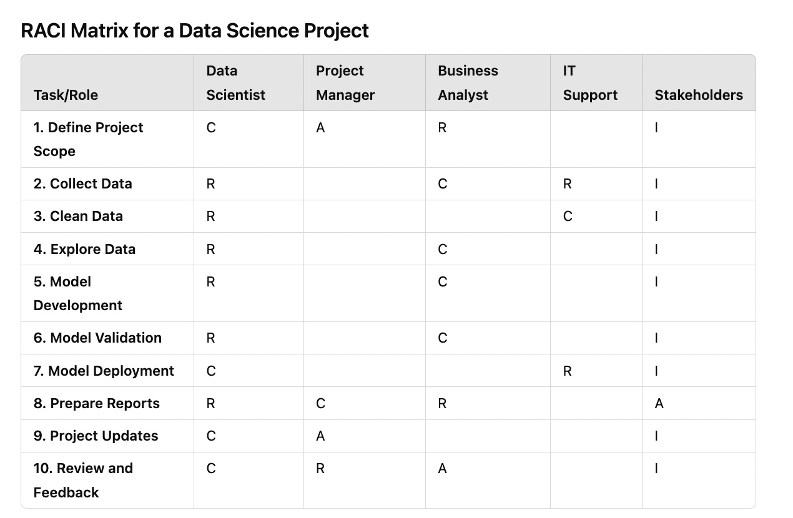

RACI matrix
===========
Convert to Markdown
Creating a RACI matrix for a data science project involves defining clear roles and responsibilities across different tasks. RACI stands for Responsible, Accountable, Consulted, and Informed. Here’s a simple example of what a RACI matrix might look like for a typical data science project:

### RACI Matrix for a Data Science Project

### Key:

*   **R** (Responsible): Person or role that performs the task.
*   **A** (Accountable): Person or role ultimately accountable for the task and the main decision maker; there should only be one accountable person.
*   **C** (Consulted): Person or roles whose opinions are sought; typically subject matter experts.
*   **I** (Informed): Person or roles that need to be kept informed of progress or decisions; they do not need to be consulted.

This is a general example; your specific matrix might differ based on the project scale, complexity, and team structure. Adjust it to fit the specific needs and roles within your organization or project.

